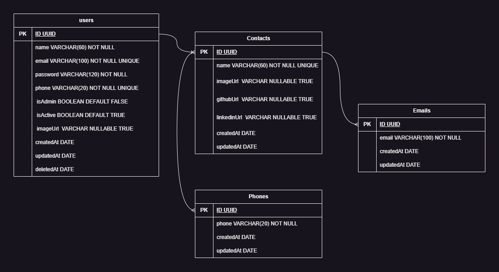

# Welcome to the Contact List API!   

Contact List is an API that aims to simulate a list of contacts. Where the logged in user can register his contacts, list them, update them, add more than one phone number or email for the same contact and delete them.

Users, in addition to being able to register their contacts, can add relevant information such as Portfolio, Linkedin and Github, making the application more versatile.

It is also possible to create an administrator account, but it must be activated manually in the bank, by default isAdmin is false.

All added contacts will only be accessible by the user or administrator.

## Diagram 



## Documentation
* Project was dockerized by Insomnia.
* [Documentation Contact List API](https://contacts-list-api-documentation.vercel.app/)

## Technologies and Libraries:

* Node
* Express
* TypeScript
* TypeORM
* bcryptjs
* dotenv
* cors
* express-async-errors
* jsonwebtoken
* pg / pg-format
* ts-node / ts-node-dev
* yup

## Installation

To clone and run this repository, you will need to have it installed on your computer.

<div>
  
  
  
  
</div>

* It is necessary to create an .env file with the .env.example settings.
* Check which PORT your Front End and Back End are in because if they are on the same port it may not work.

To launch the application on your machine, follow these steps:

```bash
# Clone this repository
git clone https://github.com/JSDiniz/ContactsListApi
# Enter the repository
cd ContactsListApi
# Install the dependencies
yarn
# Run the migrations
yarn typeorm migration:run -d .\src\data-source.ts
# Run the application
yarn dev
```

## Devs
* [Junielson Diniz](https://www.linkedin.com/in/junielson-diniz/)
